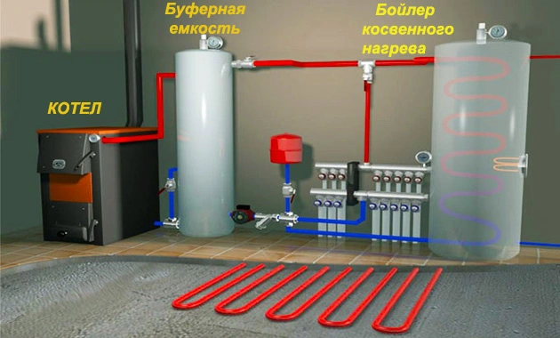
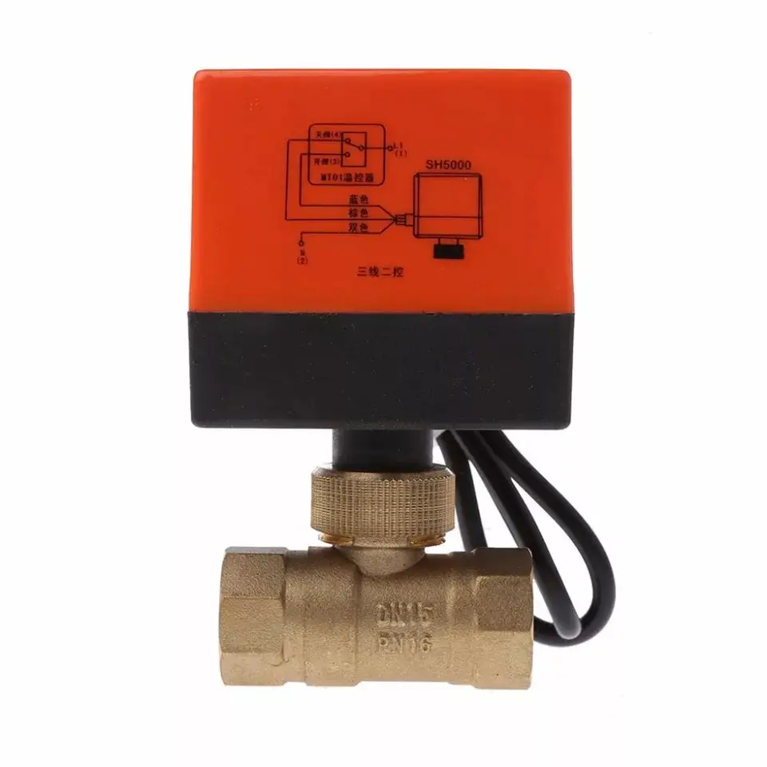
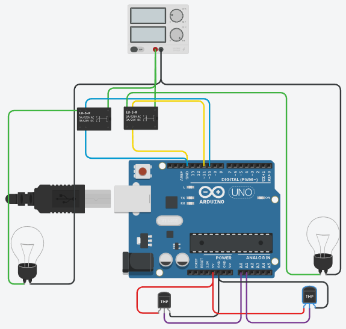

# 🔥 Automatic Solid Fuel Boiler Controller  
### Embedded Control System for Energy-Efficient Heating Management

**MCU:** Arduino Nano (ATmega328P)  
**Logic Voltage:** 5V  
**Actuator Voltage:** 220V AC  
**Sensors:** 2× DS18B20 (1-Wire)  
**Category:** Applied Embedded Control System  

---

## 📌 1. Problem Statement

In solid fuel heating systems with a buffer tank and an indirect water heater, improper coolant routing can lead to:

- Supplying coolant to the heater colder than the water inside it  
- Overheating of the indirect water heater  
- Reduced overall system efficiency  
- Thermal imbalance between boiler, buffer tank, and heater  

Manual control of the valve is inefficient and unsafe under dynamic temperature changes.

This project was developed to:

- Automatically regulate coolant flow  
- Improve energy efficiency  
- Prevent indirect heater overheating  
- Ensure thermal protection of the system  

---

## 🏗 2. System Architecture

The system integrates:

- Solid fuel boiler  
- Buffer tank  
- Indirect water heater  
- 220V motorized ball valve (OPEN / CLOSE)  
- Embedded controller  

### Hydraulic System Layout

### Regulation Logic

The valve ensures:

- Coolant supplied to the indirect heater is not colder than the water inside it  
- If heater temperature exceeds 60°C, the valve closes  
- Valve position depends on boiler-to-heater temperature difference  

---

## ⚙️ 3. Hardware Design

### Controller
- Arduino Nano (ATmega328P, 16 MHz)

### Temperature Sensors
- 2× DS18B20
- 1-Wire interface
- Individual device addresses

### Actuator

220V motorized ball valve with built-in limit switches:

- Two control directions:
  - OPEN
  - CLOSE
- Built-in mechanical end stops

### Power & Isolation

- Relay-based control of 220V actuator  
- Electrical separation between low-voltage logic and high-voltage stage  

---

## 🧪 4. Simulation & Prototyping

The electronic system was modeled in Tinkercad for validation:

Simulation allowed validation of:

- Sensor wiring  
- Relay control logic  
- Firmware behavior  

---

## 🧠 5. Firmware Architecture

Refactored to a **non-blocking state-based architecture**.

### Control Layers

**1️⃣ Sensor Layer**
- Temperature polling every 1000 ms
- Uses `millis()` for non-blocking timing

**2️⃣ Decision Layer**
- Compares:
  - `cotel` (boiler temperature)
  - `voda` (heater temperature)
- Applies threshold `BasicTemp = 60°C`

**3️⃣ Actuator Layer**
- State-controlled valve movement
- 25-second movement window
- Mutual exclusion logic
- Prevents simultaneous OPEN and CLOSE activation

---

## 🔄 6. Control Algorithm

### Valve Opens When:
- Boiler temperature > Heater temperature

### Valve Closes When:
- Boiler temperature < Heater temperature  
- Heater temperature exceeds 60°C  

### Movement Control:
- Relay activated for 25 seconds
- Internal limit switches stop mechanical motion
- Firmware enforces timing constraint

---

## 🛡 7. Safety Considerations

- Mechanical end-stop protection (built-in limit switches)
- Software mutual exclusion
- Time-limited actuator activation
- Non-blocking control logic
- Overheat prevention via temperature threshold

Reduces risk of:
- Valve motor burnout  
- Boiler overheating  
- Thermal instability  

---

## 🏠 8. Real-World Deployment

- Installed in a residential heating system  
- Operated continuously for over 1 year  
- Tested under real seasonal temperature conditions  
- Improved energy efficiency and thermal balance  

---

## 🔧 9. Engineering Improvements (Future Work)

- Add watchdog timer  
- Add EEPROM configuration storage  
- Implement PID temperature control  
- Add sensor fault detection  
- Replace relay stage with opto-isolated triac module  
- Migrate to STM32 platform  
